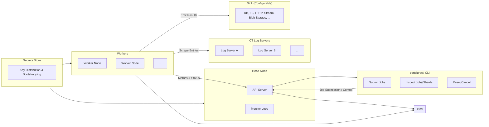

# certslurp

certslurp is a distributed system for high-performance scraping and analysis of Certificate Transparency (CT) logs. It is designed to handle billions of CT entries at multi-gigabit per second throughput, while remaining flexible, fault-tolerant, and easy to operate across a range of deployment models.

Certslurp has been used reliably in production to process over 230 TB of raw Certificate Transparency log entries, across tens of billions of certificates, at sustained throughputs exceeding 3 Gbps.

Certificate Transparency logs are a firehose of cryptographic data: billions of X.509 certificates, updated continuously. Operating at this scale requires bringing the following principles together, making it possible to scrape, filter, and analyze the CT ecosystem as if it were just another data stream.

* **Scale:** Split massive logs into shards that can be worked in parallel. Efficiently scrape and process CT logs containing billions of entries. The system is built to saturate available network and compute resources, scaling linearly with the number of worker nodes.

* **Performance:** Maximize network and CPU while minimizing coordination overhead. Achieve sustained multi-gigabit throughput by aggressively parallelizing log traversal, batching fetches, and minimizing per-shard coordination overhead.

* **Resilience:** Prevent partial or inconsistent results in the presence of failures. Workers and head nodes can come and go; shard leases ensure progress continues safely even during churn. Failed shards can be retried or reset without manual bookkeeping.

* **Flexibility:** Support different output pipelines for researchers, operators, or downstream analysis systems. Jobs are configurable via declarative specs that control fetching (index ranges, shard sizing, concurrency), matching (regex/domain filters, SCT timestamp filters), and output (chunking, transformation, sink).

* **Observability:** Track job, worker, and shard progress with explicit state transitions, shard retries, metrics reporting, and reconciliation loops.

* **Deployment-agnostic:** Run on a laptop for testing, scale to clusters with dozens or hundreds of workers, or integrate into Kubernetes and cloud environments.

### Architecture

##### Head Node
The authoritative control plane.

* Maintains global job and shard state in etcd.
* Exposes an API for job submission, worker reporting, and monitoring.
* Periodically reconciles job state, promoting jobs through pending → running → completed/failed/cancelled.
* Detects and heals inconsistent state (e.g., a job marked “cancelled” but with no remaining active shards).

##### Stateless Workers

* Acquire shard leases from etcd.
* Fetch entries from CT logs at high throughput.
* Apply matching rules (subject, issuer, domain, SCT timestamp, etc.).
* Emit results through configurable sinks.
* Report metrics and shard completion/failure to the head node.

##### Operator Interface

* CLI (`certslurpctl`)
* Submit jobs declaratively via YAML/JSON/flags.
* Inspect job/shard/worker state.
* Reset failed shards or resume cancelled/failed jobs.
* Print results in JSON or tabular form for human-friendly monitoring.

##### Secrets Store

* Provides key distribution and worker approval. Ensures only trusted nodes can participate in the cluster.

##### Sharding & Leases

* CT logs are divided into shards (ranges of log indices).
* Each shard is assigned a lease, which a worker must renew while processing.
* Expired leases allow shards to be reassigned automatically, preventing stuck work.
* Retries and backoff logic ensure robustness against transient errors.
* Shards are resettable either manually or automatically when retry thresholds are reached.

### Project Goals

Many tools exist for the monitoring and retrieval of data from Certificate Transparency logs, but accessing comprehensive datasets in formats friendly to data engineers can be difficult. While some researchers have compiled limited datasets in tools like Google BigQuery, these can be difficult to share, update, or customize for new use cases. certslurp aims to close this gap and support open security research by offering a performant, flexible, and open platform for working with CT data at scale.

###### Support Open Security Research

Lower the barrier for academics, journalists, and independent researchers to work with CT data at scale, without requiring access to closed datasets or specialized infrastructure.

###### Democratize Access to CT Logs

Make it feasible for anyone (from students to established research labs) to collect, study, and analyze CT data that has traditionally been difficult to aggregate comprehensively.

###### Enable Large-Scale Transparency Initiatives

Provide a shared, open-source foundation for projects that need billions of certificates for longitudinal studies, ecosystem health assessments, or Internet governance research.

###### Empower CT Log Operators

Offer CT log operators a community tool they can use to simulate scraping load, stress-test log infrastructure, and validate compliance with performance and availability expectations.

###### Encourage Collaboration

Create common ground for security practitioners, data scientists, and infrastructure engineers by providing a flexible, shared platform to exchange methods, results, and datasets.

###### Promote Reproducibility and Accountability

Allow research findings or incident investigations based on CT data to be more easily reproduced by third parties, improving trust in published results.

###### Foster Education and Outreach

Serve as a teaching tool for students or newcomers to security, demonstrating the scale, richness, and challenges of the CT ecosystem in a hands-on way.

###### Strengthen Internet Trust

Contribute to the broader mission of protecting users from malicious certificates, mis-issuance, and opaque CA practices by making CT data more accessible for analysis.
